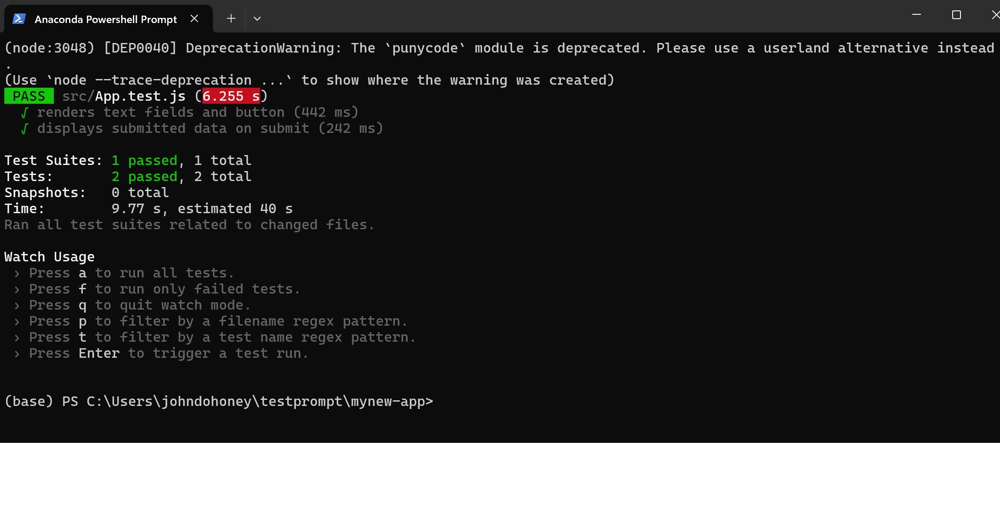

# Unit testing

Our scaffolding included testing for the sample React app, this obviously will not work, so we will get CoPilot to help with basic tests of our UI.

```jsx
import { render, screen } from '@testing-library/react';
import App from './App';

test('renders learn react link', () => {
  render(<App />);
  const linkElement = screen.getByText(/learn react/i);
  expect(linkElement).toBeInTheDocument();
});
```
**Co Pilot Chat Prompt**: Update to the app.test.js so that it tests for both success and failure all of our MUI version 4 components

GitHub Copilot: To test your Material-UI components, you can use a library like `@testing-library/react`. Here's how you can update your `app.test.js` file to test for both success and failure of your components:

```javascript
import React from 'react';
import { render, fireEvent } from '@testing-library/react';
import App from './App';

test('renders text fields and button', () => {
  const { getByLabelText, getByRole } = render(<App />);

  const firstNameField = getByLabelText(/First Name/i);
  const lastNameField = getByLabelText(/Last Name/i);
  const hobbyField = getByLabelText(/Hobby/i);
  const button = getByRole('button', { name: /Submit/i });

  expect(firstNameField).toBeInTheDocument();
  expect(lastNameField).toBeInTheDocument();
  expect(hobbyField).toBeInTheDocument();
  expect(button).toBeInTheDocument();
});

test('displays submitted data on submit', () => {
  const { getByLabelText, getByRole, getByDisplayValue } = render(<App />);

  const firstNameField = getByLabelText(/First Name/i);
  const lastNameField = getByLabelText(/Last Name/i);
  const hobbyField = getByLabelText(/Hobby/i);
  const button = getByRole('button', { name: /Submit/i });

  fireEvent.change(firstNameField, { target: { value: 'John' } });
  fireEvent.change(lastNameField, { target: { value: 'Doe' } });
  fireEvent.change(hobbyField, { target: { value: 'Reading' } });
  fireEvent.click(button);

  const submittedData = getByDisplayValue(/First Name: John, Last Name: Doe, Hobby: Reading/i);
  expect(submittedData).toBeInTheDocument();
});
```

The first test checks that the text fields and button are rendered. The second test checks that the submitted data is displayed when the form is submitted. The `fireEvent.change` function is used to simulate changing the text fields, and the `fireEvent.click` function is used to simulate clicking the button. The `getByDisplayValue` function is used to get the submitted data text field by its display value.

---

**Co Pilot Chat Prompt**:  react-scripts test
(node:5684) [DEP0040] DeprecationWarning: The `punycode` module is deprecated. Please use a userland alternative instead.
(Use `node --trace-deprecation ...` to show where the warning was created)
 FAIL  src/App.test.js (39.466 s)
  × renders text fields and button (208 ms)
  × displays submitted data on submit (96 ms)

  ● renders text fields and button

    TestingLibraryElementError: Found a label with the text of: /First Name/i, however no form control was found associated to that label. Make sure you're using the "for" attribute or "aria-labelledby" attribute correctly.


GitHub Copilot: The error message suggests that the test is finding a label with the text "First Name", but it's not finding a form control (like an input or select) associated with that label. 

In Material-UI, the TextField component uses the `InputLabel` component for the label, which doesn't associate the label with the input using the `for` attribute. Instead, it uses the `id` prop on the TextField component to associate the label with the input.

To fix this issue, you need to add `id` props to your TextField components in your `App.js` file. Here's how you can do it:

```javascript
import React, { useState } from 'react';
import TextField from '@material-ui/core/TextField';
import Button from '@material-ui/core/Button';
import './App.css';

function App() {
  const [firstName, setFirstName] = useState('');
  const [lastName, setLastName] = useState('');
  const [hobby, setHobby] = useState('');
  const [submittedData, setSubmittedData] = useState('');

  const handleSubmit = (event) => {
    event.preventDefault();
    setSubmittedData(`First Name: ${firstName}, Last Name: ${lastName}, Hobby: ${hobby}`);
  };

  return (
    <div className="App">
      <form onSubmit={handleSubmit}>
        <TextField id="firstName" label="First Name" variant="outlined" value={firstName} onChange={e => setFirstName(e.target.value)} />
        <TextField id="lastName" label="Last Name" variant="outlined" value={lastName} onChange={e => setLastName(e.target.value)} />
        <TextField id="hobby" label="Hobby" variant="outlined" value={hobby} onChange={e => setHobby(e.target.value)} />
        <Button variant="contained" color="primary" type="submit">
          Submit
        </Button>
      </form>
      {submittedData && <TextField id="submittedData" label="Submitted Data" variant="outlined" value={submittedData} InputProps={{readOnly: true}} />}
    </div>
  );
}

export default App;
```

This code adds `id` props to the TextField components, which should fix the issue with your tests.

---

re-run your tests

```
npm test
```

You will see the 2 tests in the test suite run successfully
